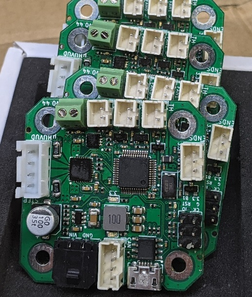
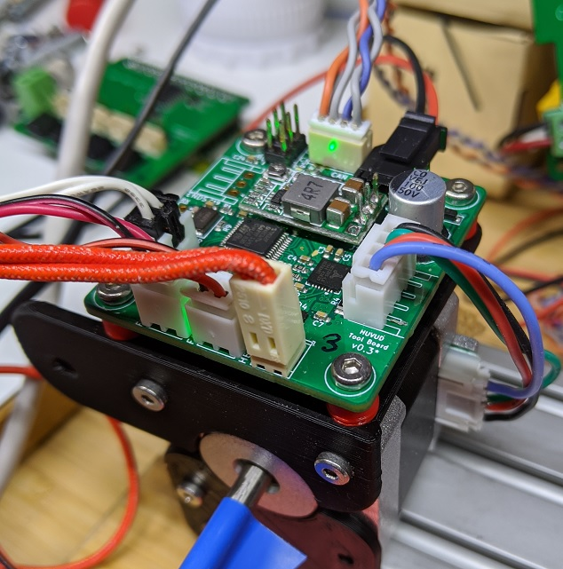
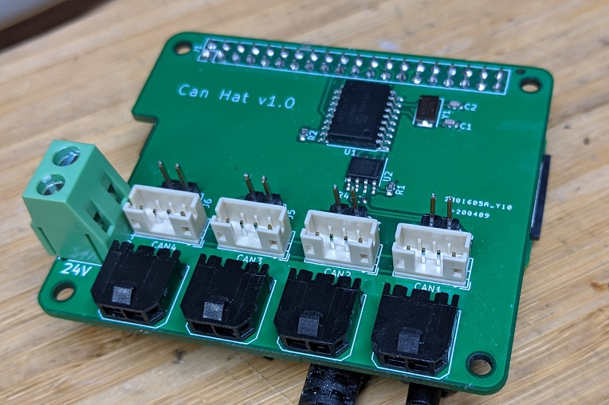

# Huvud 3D Printer toolhead board
A very small 3D printer board for use on a direct drive toolhead. It is designed to be used with Klipper firmware.
Klipper has the awesome feature to be able to use multiple MCUs connected to the host over a (relatively) high latency connection. Using CAN bus it is possible to chain many boards using just a pair of twisted wires and power. A good solution for multiple head 3D printers.

Features: 
* CAN bus. 
* One TMC2209 stepper driver for the extruder
* Two MOSFETs for fans
* One big MOSFET for the hotend heater
* Thermistor input
* Support for an endstop (or filament runout sensnor)
* STM32F103 72Mhz MCU
* USB, for flashing firmware

Main power is 12-24V. 24V is preferred to keep the currents low

All done in KiCad and open source. 

If you are interesting in helping out, testing or eventually using this board feel free to contact me at glpontus@gmail.com.

### Documentation

* [Pinout and hook up](doc/pinout.md)
* [Klipper configuration](doc/klipper.md)
* [CAN bus](doc/canbus.md)
* [Prototype versions of the board](doc/versions.md)

---

Read more about the project activites over at hackaday:
https://hackaday.io/project/174429-huvud-a-3d-printer-tool-head-controller-board

---

## 2020-05-18:

First prototype production run is done.

They work!

---
## 2020-05-29:

After a lot of software work and many hours of testing I can report that everything actually works as intended (except one resistor that was a 10k insteadof 1k)

* The thermistor input gives a very low noise signal, even at high temperatures.
* Endstop works
* All mosfet outputs works with reasonable loads (2A at 24V). I do not have a dummy load for high load testing, but a heater on the FAN connectors and a hotbed to the heater connector...
* The thermals of the TMC2209 seems ok. With no cooling fins or active cooling it reaches 60C (top and bottom) when mounted close to a hot stepper. I should test with a larger stepper (>1.5A) in a hotter environment to see when the TMC shuts down. I am considering a different fab that allows thicker copper layers for better heat spead, and better power margins.
* The CAN bus works good after some software work. It should work fine with up to 8 nodes on each bus, possibly more. I have run 4 boards on the same bus, each with one stepper, simulating a complete 3D printer.

It is possible to fit different connectors for most functions. It is designed for mostly angled JST-XH or screw terminals but it's possible to fit straight connectors or other 2.54mm for most functions. JLCPCB do not mount through holes so the boards come without connectors.
For a larger (>30) production run the boards would have to be panellized, which looks like a non-trivial task with KiCAD. If anyone has experience and wants to help ...

---
## 2020-06-10:

Version 0.4 is almost complete.

* It has an on-board 3.3V regulator replacing the external board. (Quite a challenge for an old SW engineer using JLCPCB's very limited selection of components)
* Thermistor connector moved down next to the fan/heater connectors
* Lower profile capacitor for the stepper driver, it was very tall.
* Debug header moved and extended. BOOT1 exposed.
* Serial pins removed, not very useful anyway
* Fan/heater connectors tweaked to be able to fit JST XH, screw terminals or Molex KK connectors.
* Added a micro-USB connector for easier flashing and possibly other features. The board is not powered from USB.
* Switched to an STM32F103. Mainly to allow for a proper bootloader and flashing over USB. Or even over CAN if I develop a custom bootloader. With many boards it would be very nice to be able to bulk flash them all at once over CAN.

I have done thermal stress testing of the board. It can run a big stepper at 1.5A, board attached very close to the hot stepper with no forced airflow and 25C ambient. The driver reaches 90C (measured with a probe) but does not shut down due to overheating. The entire board heats up as designed to act as a heatsink, most inner and outer copper layers are groundplanes to spread the heat. 

I'll very soon order another 20-30 board to send out to brave beta testers.

---
## 2020-06-24

Ready to manufacture some more prototypes

Among many small tweaks the heater mosfet is changed to a different one with better Rds at 3.3V Vgs. If I limit the board to 24V and a 40W heater it could use the same small mosfet as for the fans.

Unfortunately JLCPCB are out of TMC2209 so I'll have to find a different prototype house that has them available. Perhaps one with 2oz outer copper layers for better thermals.

CAN bus is surprisingly robust. I have tested it through a 50m roll of ethernat cable, various sketchy test setups with star networks, breadboards, close to EMC sources etc. It always works. The Bosch engineers did a good job almost 40 years ago. 

---

# Can Hat

As a sub project to this board I have developed a little power and CAN distribution board combined with an MCP2515 CAN bus controller in the form of a Raspberry Pi Hat. It is a very simple little board but has turned out to be very valuable.

With some more thought put into it I think it will be a good complement to the Huvud tool board. 

---

