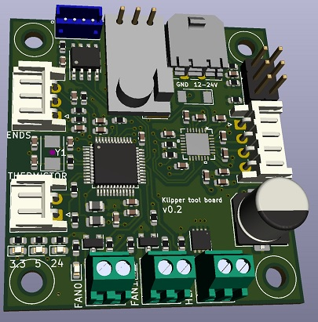

# Klipper Toolboard
A very small 3D printer board for use on a toolhead.

Features: 
* TMC2209 driver
* STM32F103C8T6
* Two MOSFET drivers fans
* One big MOSFET driver for a hotend heater
* Thermistor input
* One endstop

Main power is 12-24V

Communication with host is done via micro USB, small electronics is powered though that

Possible issues:
* Is the cooling for the TMC2209 adequate?

