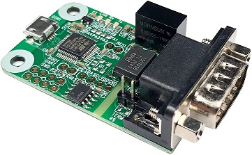

# Working with CAN bus

## Adapters

You will need a CAN bus adapter for your Raspberry Pi (or other board you run klippy on). There are many options available.

The adapter must support Linux socketcan

### USB CAN adapter

There is a very good open source firmware for STM32 based USB adapters, https://github.com/candle-usb/candleLight_fw. Any board running this firmware should work fine. There are plenty of open source hardware alteratives that runs this firmware.

Get one at https://openlightlabs.com/products/canable-0-4 or find a clone on aliexpress.

Innomaker has an USB CAN bus adapter widely available. It had a firmware bug that was reported and fixed March 2020, newer boards should have this fixed. 

### MCP2515 based CAN HATs

The MCP2515 is a very common SPI connected CAN bus chip. It is a pretty bad options since it has very small buffers on chip and creates a lot of CPU load on the Raspberry Pi, and has a tendency to drop packet. It is not recomended if you use more than 1 or 2 boards or if you plan to use the accelerometer.

You have to run the CAN bus at 250kbits/s or possibly 500kbits/s. An older Pi, or a Pi Zero will not work reliably, it has to be a Pi3 or Pi4 or better.

An easily available option is "Waveshare RS485 CAN HAT"

TBD: Is the MCP2517/MCP2518 based HATs any better? They are made for CAN-fd but are backwards compatible. As the drivers are not in the mainline kernel it's non-trivial to get an MCP2517/8 to work. 

## Linux and Klipper setup

Please read https://github.com/KevinOConnor/klipper/blob/master/docs/CANBUS.md

## Wiring

### Cables

CAN bus is a bus, it must be terminated at each end with 120ohm resistors.

Twisted pair ... Ethernet cables or specifically made CAN bus cables. If shielding is used it should only be grounded at one point.

As we run default at 500kbits/s each stub length can be up to 1.6m long.

