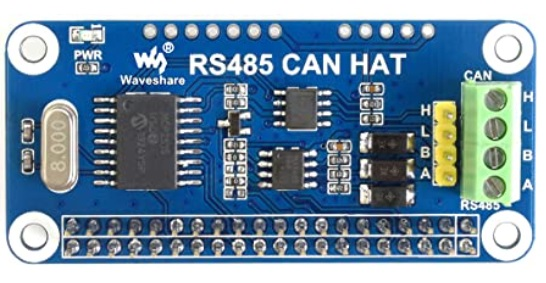

# Working with CAN bus

## Adapters

You will need a CAN bus adapter for your Raspberry Pi (or other board you run klippy on). There are many options available.

### MCP2515 based CAN HATs

The MCP2515 is a very common SPI connected CAN bus chip. It is a pretty bad options since it has very small buffers on chip and creates a lot of CPU load on the Raspberry Pi. It is not recomended if you use more than 1 or 2 boards.

When using an MCP2515 hat you have to increate the linux CAN bus tx queue length or the system will not be stable. "ip link set can0 txqueuelen 128". This is again due to the lack of buffers in the MCP2515.

TBD: The txqueue can be set at reboot using udev, how is that done?

TBD: Is the MCP2517FD based HATs any better? They are made for CAN-fd but should be backwards compatible.

Easily available option is "Waveshare RS485 CAN HAT"

There are some dirt cheap MCP2515 boards made for arduino. Some hacking might be needed to make them use 3.3V for SPI, the raspberry is not 5V tolerant!

### USB CAN adapter

The better option

Easily available option is "Innomaker CAN to USB adapter". It is even optically isolated. 

## Linux setup

The klipper CAN bus implementation needs a program to run on the host that tunnels serial over CAN bus to the Huvud boards.

https://github.com/bondus/CanSerial

The program will open virtual serial ports in /tmp when boards are discovered on the CAN bus. The serial ports are named depending on the unique ID of the STM32 MCUs. Such as /tmp/ttyCAN0_0d8da6c6698e.

## Wiring

### Connecting Huvud

There are two options to connect the Huvud board, either use the 4-pin JST-PH connector or the combined power and CAN bus Molex Micro-fit. All CANL pins are connected together on the board, same with the CANH pins.

### Cables

CAN bus is a bus, it must be terminated at each end with 120ohm resistors.

Twisted pair ... Ethernet cables or specifically made CAN bus cables. If shielding is used it should only be grounded at one point.

As we run default at 500kbits/s each stub length can be up to 1.6m long.

