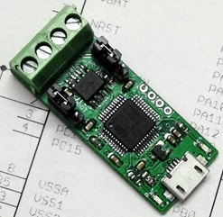

# Working with CAN bus

## Adapters

You will need a CAN bus adapter for your Raspberry Pi (or other board you run klippy on). There are many options available.

### MCP2515 based CAN HATs

The MCP2515 is a very common SPI connected CAN bus chip. It is a pretty bad options since it has very small buffers on chip and creates a lot of CPU load on the Raspberry Pi. It is not recomended if you use more than 1 or 2 boards. 

You have to run the CAN bus at 250kbits/s or possibly 500kbits/s. An older Pi, or a Pi Zero will not work reliably, it has to be a Pi3 or Pi4 or better.

When using an MCP2515 hat you have to increase the linux CAN bus tx queue length or the system will not be stable. "ip link set can0 txqueuelen 128". This is again due to the lack of buffers in the MCP2515.

TBD: Is the MCP2517FD based HATs any better? They are made for CAN-fd but are backwards compatible. As the drivers are not in the mainline kernel it's non-trivial to get an MCP2516 to work. 

An easily available option is "Waveshare RS485 CAN HAT"

### USB CAN adapter

There is a very good open source firmware for STM32 based USB adapters, https://github.com/candle-usb/candleLight_fw. Any board running this firmware should work fine. There are plenty of open source hardware alteratives that runs this firmware. Unforunately they can be a bit hard to buy and you have to turn to aliexpress or ebay to find clones. Search for canable or cantact.

If someone can find a good board please tell me so I can recomend one.

The Innomaker This product is readily available on Amazon and many other places. It's optically isolated and high performace, a good product on paper.

Update Feb 2 2021: Unfortunately this adapter has bugs in the firmware that reorders incoming packets when reveiving a lot of data. It causes major problems for klipper. Not recomended!

## Linux setup

The klipper CAN bus implementation needs a program to run on the host that tunnels serial over CAN bus to the Huvud boards.

https://github.com/bondus/CanSerial

The program will open virtual serial ports in /tmp when boards are discovered on the CAN bus. The serial ports are named depending on the unique ID of the STM32 MCUs. Such as /tmp/ttyCAN0_0d8da6c6698e.

## Wiring

### Cables

CAN bus is a bus, it must be terminated at each end with 120ohm resistors.

Twisted pair ... Ethernet cables or specifically made CAN bus cables. If shielding is used it should only be grounded at one point.

As we run default at 500kbits/s each stub length can be up to 1.6m long.

