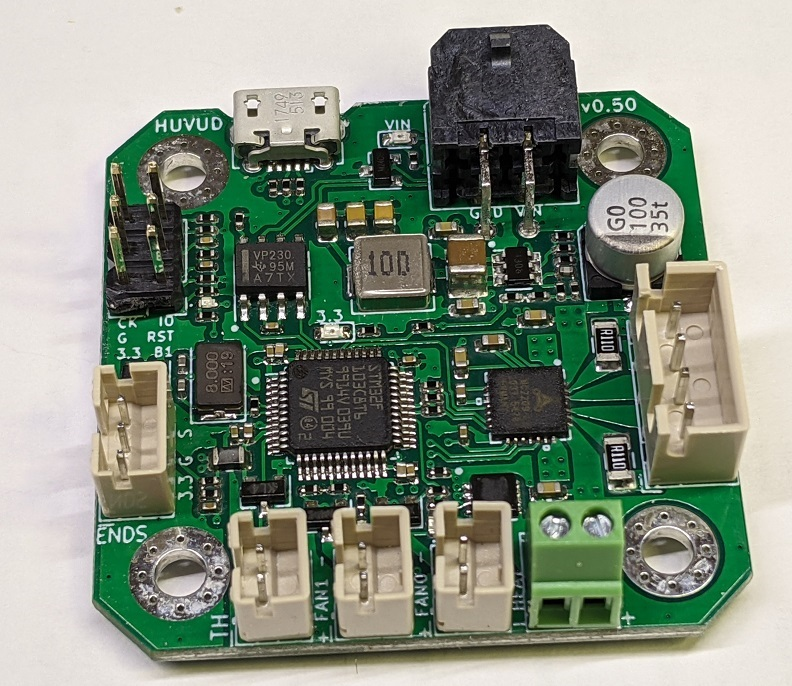

# Huvud 3D Printer toolhead board
A very small 3D printer board for use on a direct drive toolhead. It is designed to be used with Klipper firmware.
Klipper has the awesome feature to be able to use multiple MCUs connected to the host over a (relatively) high latency connection. Using CAN bus it is possible to chain many boards using just a pair of twisted wires and power. A good solution for multiple head 3D printers.

### Documentation

* [Pinout and hook up](pinout.md)
* [Klipper configuration](klipper.md)
* [CAN bus](canbus.md)
* [Prototype versions of the board](versions.md)

