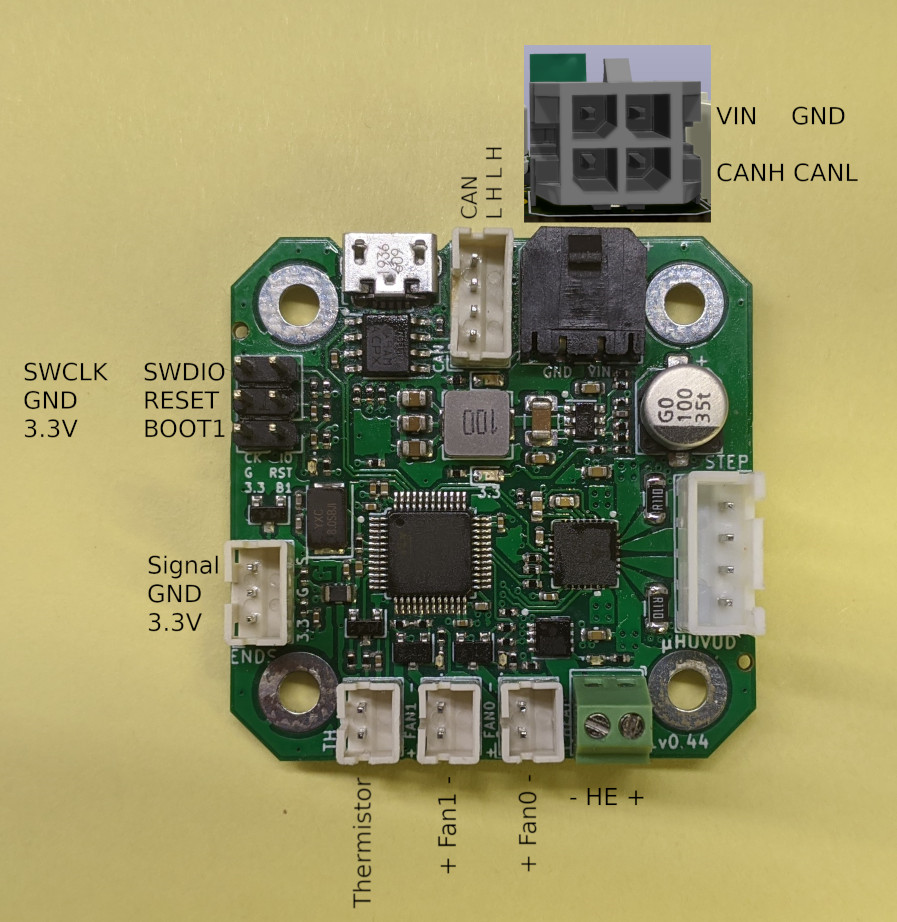
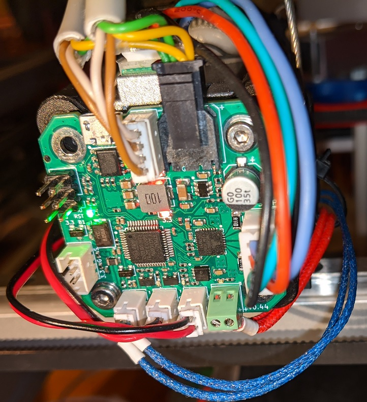
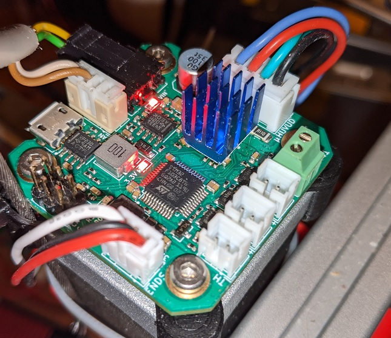

# Huvud Hardware, Pinout and Hookup

(all pictures are of pre production partially hand assembled boards, the real thing will be slighly different and look a lot better)

## Pinout 

Look at [printer.cfg](printer.cfg) for pinouts.

## Powering

The board works from 10V up to 28V. It must be powered through the Molex Micro-Fit connector. It can not be powered with USB and powering though the 3.3V must be avoided, the stepper driver can get damaged.

The power connector is rated for max 8A

## Hooking up peripherals

### Fans

JST-PH 2 mm connectors. Max 1A per fan

### Thermistor / PT1000

JST-PH 2 mm connectors. The thermistor input has a 2.2KOhm pullup resistor to allow for better resolution when using a PT1000 sensor.

### Hotend heater

Max 4A. Enough for a 100W heater when running on 24V

### Endstop

The endstop supplies 3.3V to work with an optical endstop sensors. For a microswitch (NO) connect it to GND and Signal.
Please note that klipper at the moment requires an endstop to be on the same board as the stepper driver. If the board is used for an extruder the endstop can not be used for a bed probe. The endstop can be used as a filament runout on a hotend, or as an axis endstop if the board is used for movement.

### CAN bus

Power and CAN bus in in the same Molex MicroFit connector.
There is no on board CAN bus termination resistor.

### LED

There is a user controlled green LED near the debug connector, it is connected to PC13. It is normally on while klipper is running. It's also used by the HID bootloader to signal various states.

## Thermals

The TMC2209 is a very efficient stepper driver and does not generate a large mount of heat. Still temerature should be checked if you run at high currents. The board is designed to spread the heat over the entire PCB. 

Testing shows that the board works comfortly without any extra cooling up to 1.2A driver current (it will reach about 25C above ambient). The board is designed to work up to 85C, so even if it gets very hot it will work fine. 

If the driver or boards gets too hot add small cooling fins, or if possible use a thick thermal pad on the bottom to lead the heat into something like an alu extrusion or other metal object.

If huvud is used for movement you can even monitor the temperature with a thermistor and turn on a fan if it gets too hot. 

