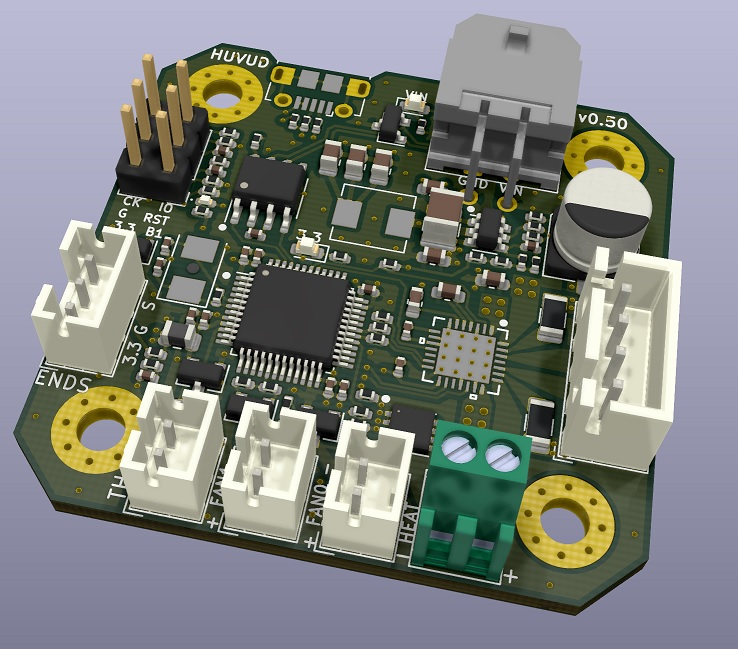
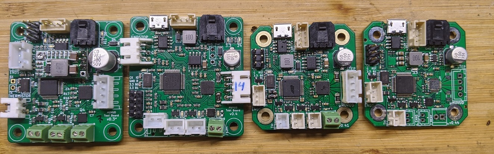

# Versions of the Huvud Toolboard

## 0.50

Volume production about to start

+ Changed the power connector from a 2x1 Molex Micro-fit to a 2x2. The 2 extra pins are used for CAN bus. Allows one single connector back to klippy.
* Removed the 4 pin CAN connector
* Added ESD protection on the CAN bus
+ Test pads on the bottom for production testing

# Prototypes

## 0.3

First Version

* 4.7k thermistor pullup
* 0.100ohm sense resistor for the TMC2209
+ It works!!!
- External 3.3V voltage regulator
- No USB, has to be flashed with an ST-LINK
- Very noisy thermistor signal (only seen when measuring, still works good in klipper)
* No SMDs smaller than 0603

## 0.4

+ USB
+ On board 3.3V voltage regulator 
+ 110ohm sense resistor

## 0.41

* 2.2k thermistor pullup to allow the use of PT1000 temperature proble
* Smaller size. 42x42 mm with 31x31 mm screw pattern, matches NEMA 17.
* Most small SMDs are 0402
* Most connectors changed to JST-PH 2.0 mm
* ESD protection on endstop and thermistor
- Weak heater MOSFET (max 4A with no margins at all)
- Forgot the pins for BOOT1, it's not possible to enter the bootloader

## 0.44

+ Greatly reduced ripple on 3.3V by redesigning and changing to a different voltage regulator IC
+ Greatly reduced thermistor noise, proper filtering of VREF
